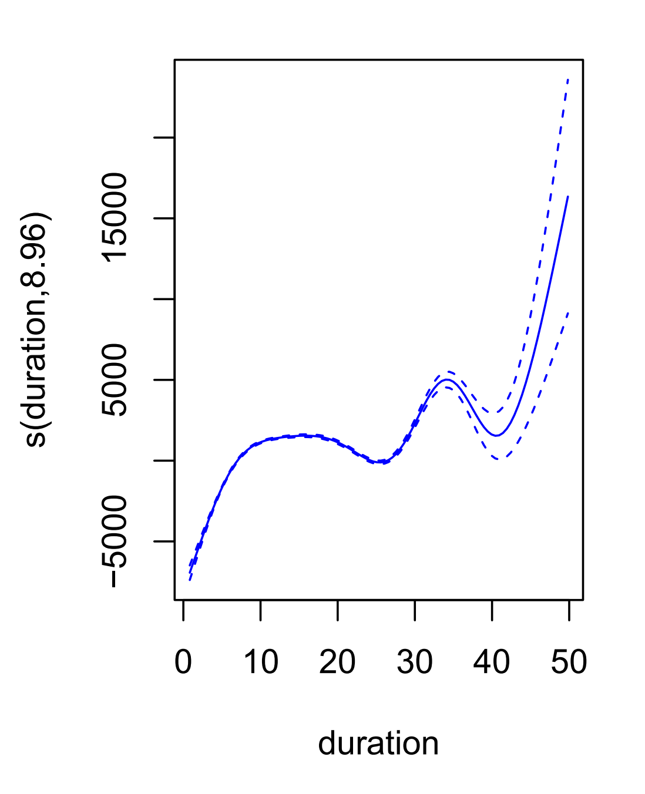
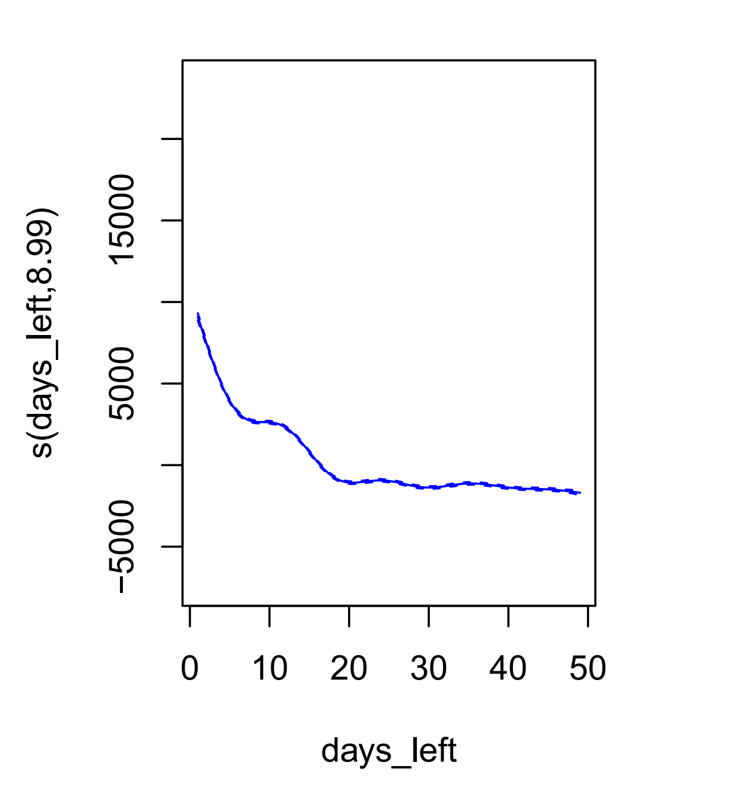
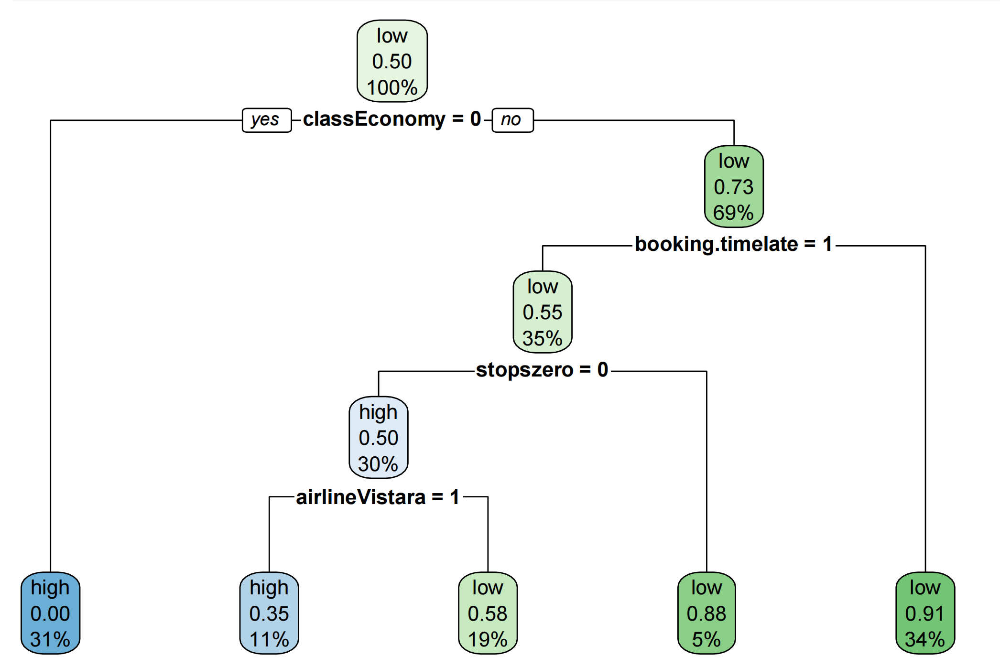

# Predicting-Flight-Price-Using-Linear-Regression-Models

# Airline Ticket Price Prediction Using Linear and Nonlinear Models

This project analyzes and predicts domestic Indian flight prices based on various features such as departure/arrival time, class, number of stops, airline, and days left before departure. We apply linear regression, polynomial regression, ridge and lasso regularization, GAMs, and decision trees to compare performance and interpret model behavior.

---

## Dataset

The dataset contains over 300,000 flight listings with 10 features:

- Categorical: `airline`, `source_city`, `departure_time`, `stops`, `arrival_time`, `destination_city`, `class`
- Numerical: `duration`, `days_left`, `price`

After dropping redundant columns, we performed extensive EDA, categorical encoding, and variable selection via chi-squared and mutual information criteria.

---

## Models Implemented

- **Multiple Linear Regression (MLR)**
- **Polynomial Regression (Degree = 5)**
- **Ridge Regression**
- **Lasso Regression**
- **Generalized Additive Model (GAM)**
- **Classification Tree (based on median price)**

Each model was evaluated via 5-fold cross-validation and tested on hold-out data.

---

## Performance Summary

| Model                    | MSE (Test)         | R² (CV)   | Notes                          |
|--------------------------|--------------------|-----------|--------------------------------|
| Linear Regression        | 47.7M              | 0.91      | Baseline linear model          |
| Polynomial Regression    | 45.6M              | 0.91      | Degree-5, strong performance   |
| Ridge Regression         | ~1.95B             | --        | Large MSE due to mismatch      |
| Lasso Regression         | ~2.51B             | --        | Strong shrinkage effect        |
| GAM                      | 45.4M              | 0.912     | Best generalization performance |
| Classification Tree      | Accuracy: 84.0%    | --        | Median-based binarization      |

---

## Visualization

### 1. Exploratory Data Analysis

- Histograms of `price`, `days_left`, `duration`
- Bar charts of `airline`, `class`, `departure_time`

### 2. Regression Line Fitting (GAM and Polynomial)

  


### 3. Tree Visualization



### 4. Feature Selection

- Mutual Information barplot
- Chi-Squared scores

---

## Technical Details

- **Language**: R
- **Packages**: `ggplot2`, `caret`, `glmnet`, `mgcv`, `rpart`, `leaps`, `FSelector`
- **Cross-validation**: 5-fold CV using `caret::trainControl()`

---

## Getting Started

### 1. Clone the repository
```bash
git clone https://github.com/yourusername/airline-price-regression.git
cd airline-price-regression
